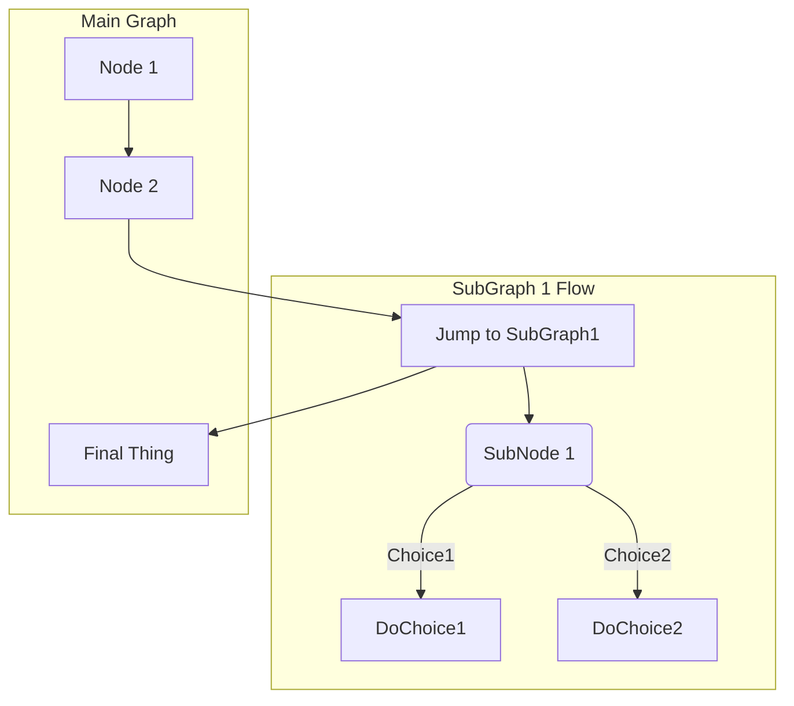

# App UI

Produktor front-end static application based on angular and material design and to be hosted on github to be view over  CDN's like github.io etc.

## Requirements

* Angular
* TypeScript


```yaml
title: About Front Matter
language: yaml
```

+++
title = "About Front Matter"
[example]
language = "toml"
+++

~"feature request"



